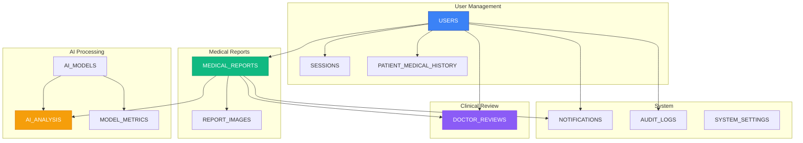

# Database ER Diagram - Visual Representation

This diagram shows the complete database schema with all tables, relationships, and key constraints.

## Complete Database Schema

```mermaid
erDiagram
    USERS ||--o{ SESSIONS : "has"
    USERS ||--o{ MEDICAL_REPORTS : "is patient"
    USERS ||--o{ MEDICAL_REPORTS_RAD : "uploads as radiologist"
    USERS ||--o{ DOCTOR_REVIEWS : "creates"
    USERS ||--o{ NOTIFICATIONS : "receives"
    USERS ||--o{ PATIENT_MEDICAL_HISTORY : "has"
    USERS ||--o{ AUDIT_LOGS : "performs"
    
    MEDICAL_REPORTS ||--o{ REPORT_IMAGES : "contains"
    MEDICAL_REPORTS ||--|| AI_ANALYSIS : "analyzed by"
    MEDICAL_REPORTS ||--o{ DOCTOR_REVIEWS : "reviewed in"
    MEDICAL_REPORTS ||--o{ NOTIFICATIONS : "triggers"
    
    AI_MODELS ||--o{ AI_ANALYSIS : "generates"
    AI_MODELS ||--o{ MODEL_METRICS : "tracked by"
    
    USERS {
        uuid id PK
        varchar name
        varchar email UK
        varchar password_hash
        varchar role "CHECK: patient|radiologist|doctor|tech"
        text profile_picture_url
        varchar phone
        date date_of_birth
        timestamp created_at
        timestamp updated_at
        timestamp last_login_at
        boolean is_active
        boolean is_email_verified
        jsonb preferences
        uuid created_by FK
        uuid updated_by FK
    }
    
    SESSIONS {
        uuid session_id PK
        uuid user_id FK
        varchar token UK
        varchar refresh_token
        inet ip_address
        text user_agent
        jsonb device_info
        timestamp login_time
        timestamp last_activity
        timestamp expires_at
        boolean is_active
        timestamp logout_time
    }
    
    MEDICAL_REPORTS {
        uuid report_id PK
        uuid patient_id FK
        uuid radiologist_id FK
        varchar patient_name
        varchar radiologist_name
        varchar study_type
        text report_image_url
        jsonb image_metadata
        varchar risk_score "CHECK: low|medium|high"
        decimal confidence_score "0-1"
        text findings
        jsonb recommendations
        timestamp upload_date
        timestamp analysis_date
        varchar status "CHECK: pending|analyzing|analyzed|reviewed|archived"
        integer patient_age
        varchar patient_gender
        jsonb medical_history
        jsonb symptoms
        timestamp created_at
        timestamp updated_at
        uuid created_by FK
        uuid updated_by FK
    }
    
    REPORT_IMAGES {
        uuid image_id PK
        uuid report_id FK
        text image_url
        varchar image_type "xray|ct_scan|mri"
        varchar image_format "JPEG|PNG|DICOM"
        integer width
        integer height
        bigint file_size
        jsonb dicom_metadata
        timestamp uploaded_at
        integer display_order
    }
    
    AI_MODELS {
        uuid model_id PK
        varchar model_name
        varchar version
        varchar architecture "CNN|ResNet|EfficientNet"
        varchar framework "TensorFlow|PyTorch"
        text model_file_url
        bigint model_file_size
        jsonb model_config
        timestamp trained_date
        varchar training_dataset_version
        decimal training_duration_hours
        timestamp deployed_date
        boolean is_active
        decimal baseline_accuracy
        decimal baseline_precision
        decimal baseline_recall
        decimal baseline_f1_score
        text description
        timestamp created_at
        uuid created_by FK
    }
    
    AI_ANALYSIS {
        uuid analysis_id PK
        uuid report_id FK
        uuid model_id FK
        varchar risk_category "CHECK: low|medium|high"
        decimal risk_probability "0-1"
        decimal low_probability "0-1"
        decimal medium_probability "0-1"
        decimal high_probability "0-1"
        jsonb findings
        jsonb feature_maps
        jsonb attention_maps
        timestamp processed_at
        integer processing_time_ms
        decimal image_quality_score
        decimal confidence_threshold
        jsonb preprocessing_steps
        varchar model_version
        timestamp created_at
    }
    
    MODEL_METRICS {
        uuid metric_id PK
        uuid model_id FK
        decimal accuracy
        decimal precision
        decimal recall
        decimal f1_score
        integer true_positives
        integer true_negatives
        integer false_positives
        integer false_negatives
        integer total_predictions
        integer correct_predictions
        timestamp recorded_at
        timestamp period_start
        timestamp period_end
        varchar dataset_version
        integer test_set_size
        decimal auc_roc
        integer average_processing_time_ms
        text notes
    }
    
    DOCTOR_REVIEWS {
        uuid review_id PK
        uuid report_id FK
        uuid doctor_id FK
        text review_notes
        text clinical_findings
        boolean confirmed_ai_diagnosis
        integer ai_accuracy_rating "1-5"
        varchar doctor_risk_assessment "CHECK: low|medium|high"
        varchar urgency_level "CHECK: routine|follow_up|urgent|critical"
        text recommended_action
        boolean follow_up_required
        date follow_up_date
        text treatment_plan
        jsonb medication_prescribed
        timestamp reviewed_at
        timestamp created_at
        timestamp updated_at
    }
    
    NOTIFICATIONS {
        uuid notification_id PK
        uuid user_id FK
        varchar type "new_report|urgent_case|review_complete|system_alert"
        varchar priority "CHECK: low|normal|high|urgent"
        varchar title
        text message
        text action_url
        boolean is_read
        timestamp read_at
        uuid related_report_id FK
        boolean sent_via_email
        boolean sent_via_sms
        boolean sent_via_push
        jsonb metadata
        timestamp created_at
        timestamp expires_at
    }
    
    AUDIT_LOGS {
        uuid log_id PK
        uuid user_id FK
        varchar user_email
        varchar user_role
        varchar action "login|upload_report|view_report|edit_profile"
        varchar entity_type "user|report|review"
        uuid entity_id
        inet ip_address
        text user_agent
        jsonb old_values
        jsonb new_values
        varchar status "success|failure|error"
        text error_message
        timestamp created_at
    }
    
    PATIENT_MEDICAL_HISTORY {
        uuid history_id PK
        uuid patient_id FK
        jsonb conditions
        jsonb allergies
        jsonb medications
        jsonb family_history
        varchar smoking_status
        varchar alcohol_consumption
        varchar exercise_frequency
        jsonb previous_surgeries
        jsonb previous_hospitalizations
        timestamp created_at
        timestamp updated_at
        uuid updated_by FK
    }
    
    SYSTEM_SETTINGS {
        uuid setting_id PK
        varchar setting_key UK
        jsonb setting_value
        text description
        boolean is_sensitive
        timestamp created_at
        timestamp updated_at
        uuid updated_by FK
    }
```



## Simplified Relationship Diagram



## Table Relationships Summary

### One-to-Many Relationships

| Parent Table | Child Table | Relationship | Description |
|--------------|-------------|--------------|-------------|
| USERS | SESSIONS | 1:N | User can have multiple sessions |
| USERS | MEDICAL_REPORTS | 1:N | Patient has multiple reports |
| USERS | MEDICAL_REPORTS | 1:N | Radiologist uploads multiple reports |
| USERS | DOCTOR_REVIEWS | 1:N | Doctor creates multiple reviews |
| USERS | NOTIFICATIONS | 1:N | User receives multiple notifications |
| USERS | PATIENT_MEDICAL_HISTORY | 1:1 | Patient has one medical history |
| MEDICAL_REPORTS | REPORT_IMAGES | 1:N | Report can have multiple images |
| MEDICAL_REPORTS | DOCTOR_REVIEWS | 1:N | Report can have multiple reviews |
| MEDICAL_REPORTS | NOTIFICATIONS | 1:N | Report triggers multiple notifications |
| AI_MODELS | AI_ANALYSIS | 1:N | Model generates multiple analyses |
| AI_MODELS | MODEL_METRICS | 1:N | Model has multiple metric records |

### One-to-One Relationships

| Table A | Table B | Description |
|---------|---------|-------------|
| MEDICAL_REPORTS | AI_ANALYSIS | Each report has one AI analysis |

## Data Types Reference

### UUID
- Primary keys for all tables
- Foreign keys for relationships
- Generated using `uuid_generate_v4()`

### JSONB
- Flexible data structures
- Preferences, metadata, findings
- Searchable and indexable

### CHECK Constraints
```sql
-- User roles
role CHECK (role IN ('patient', 'radiologist', 'doctor', 'tech'))

-- Risk scores
risk_score CHECK (risk_score IN ('low', 'medium', 'high'))

-- Report status
status CHECK (status IN ('pending', 'analyzing', 'analyzed', 'reviewed', 'archived'))

-- Urgency levels
urgency_level CHECK (urgency_level IN ('routine', 'follow_up', 'urgent', 'critical'))

-- Probabilities (0 to 1)
confidence_score CHECK (confidence_score BETWEEN 0 AND 1)
```

## Indexing Strategy

### Primary Indexes (Automatically Created)
- All `id` columns (UUID PRIMARY KEY)
- Unique constraints (email, token, setting_key)

### Foreign Key Indexes
```sql
-- Critical foreign keys
CREATE INDEX idx_sessions_user_id ON sessions(user_id);
CREATE INDEX idx_reports_patient_id ON medical_reports(patient_id);
CREATE INDEX idx_reports_radiologist_id ON medical_reports(radiologist_id);
CREATE INDEX idx_ai_analysis_report_id ON ai_analysis(report_id);
CREATE INDEX idx_doctor_reviews_report_id ON doctor_reviews(report_id);
```

### Query Optimization Indexes
```sql
-- Filter-based queries
CREATE INDEX idx_reports_status ON medical_reports(status);
CREATE INDEX idx_reports_risk_score ON medical_reports(risk_score);
CREATE INDEX idx_notifications_is_read ON notifications(is_read);

-- Sorting queries
CREATE INDEX idx_reports_upload_date ON medical_reports(upload_date DESC);
CREATE INDEX idx_reports_analysis_date ON medical_reports(analysis_date DESC);
CREATE INDEX idx_notifications_created_at ON notifications(created_at DESC);
```

## JSONB Structure Examples

### User Preferences
```json
{
  "theme": "dark",
  "notifications_enabled": true,
  "email_notifications": true,
  "sms_notifications": false,
  "language": "en"
}
```

### AI Analysis Findings
```json
{
  "abnormalities": [
    {
      "type": "opacity",
      "location": "right upper lobe",
      "severity": "moderate",
      "confidence": 0.87
    }
  ],
  "features": {
    "edge_sharpness": 0.72,
    "contrast_level": 0.85,
    "texture_uniformity": 0.63
  }
}
```

### Medical History
```json
{
  "chronic_conditions": ["hypertension", "diabetes_type2"],
  "last_checkup": "2024-06-15",
  "blood_pressure": "140/90",
  "blood_sugar": "180 mg/dL"
}
```

## Database Views

### v_patient_reports
Combines medical reports with AI analysis and doctor reviews for patient view.

```sql
CREATE OR REPLACE VIEW v_patient_reports AS
SELECT 
    mr.report_id,
    mr.patient_id,
    mr.patient_name,
    mr.study_type,
    mr.risk_score,
    mr.confidence_score,
    mr.upload_date,
    mr.analysis_date,
    mr.status,
    aa.risk_probability,
    aa.processed_at,
    dr.review_id,
    dr.doctor_id,
    dr.urgency_level,
    dr.reviewed_at
FROM medical_reports mr
LEFT JOIN ai_analysis aa ON mr.report_id = aa.report_id
LEFT JOIN doctor_reviews dr ON mr.report_id = dr.report_id;
```

### v_doctor_priority_queue
Orders reports by risk score for doctor review prioritization.

```sql
CREATE OR REPLACE VIEW v_doctor_priority_queue AS
SELECT 
    mr.report_id,
    mr.patient_id,
    mr.patient_name,
    mr.study_type,
    mr.risk_score,
    mr.confidence_score,
    mr.upload_date,
    mr.analysis_date,
    aa.risk_probability,
    CASE 
        WHEN mr.risk_score = 'high' THEN 1
        WHEN mr.risk_score = 'medium' THEN 2
        WHEN mr.risk_score = 'low' THEN 3
        ELSE 4
    END as priority_order
FROM medical_reports mr
LEFT JOIN ai_analysis aa ON mr.report_id = aa.report_id
WHERE mr.status = 'analyzed'
ORDER BY priority_order ASC, mr.analysis_date DESC;
```

## Triggers

### Auto-update Timestamps
```sql
CREATE OR REPLACE FUNCTION update_updated_at_column()
RETURNS TRIGGER AS $$
BEGIN
    NEW.updated_at = CURRENT_TIMESTAMP;
    RETURN NEW;
END;
$$ language 'plpgsql';

-- Applied to tables:
-- - users
-- - medical_reports
-- - doctor_reviews
-- - patient_medical_history
```

## Data Integrity Rules

### Cascade Delete Rules
- `sessions` → CASCADE when user deleted
- `report_images` → CASCADE when report deleted
- `ai_analysis` → CASCADE when report deleted
- `notifications` → CASCADE when user deleted
- `patient_medical_history` → CASCADE when patient deleted

### Restrict Delete Rules
- `medical_reports` → RESTRICT when patient/radiologist deleted
- `ai_analysis` → RESTRICT when AI model deleted
- `doctor_reviews` → RESTRICT when doctor deleted

### Set Null Rules
- `notifications.related_report_id` → SET NULL when report deleted
- `audit_logs.user_id` → SET NULL when user deleted

## Performance Considerations

### Expected Table Sizes (1 year, 10,000 active users)

| Table | Estimated Rows | Estimated Size |
|-------|----------------|----------------|
| users | 10,000 | 2 MB |
| sessions | 50,000 | 10 MB |
| medical_reports | 500,000 | 200 MB |
| report_images | 500,000 | 100 MB (metadata only) |
| ai_analysis | 500,000 | 500 MB |
| doctor_reviews | 300,000 | 150 MB |
| notifications | 2,000,000 | 400 MB |
| audit_logs | 5,000,000 | 1 GB |

**Total Database Size**: ~2.5 GB (excluding actual image files)

### Optimization Recommendations
1. Partition `audit_logs` by date (monthly)
2. Archive old notifications (> 90 days)
3. Implement connection pooling (max 20-50 connections)
4. Use read replicas for reporting queries
5. Regular VACUUM and ANALYZE operations
6. Monitor slow queries with pg_stat_statements

## Security Notes

### Sensitive Data
- **passwords**: Always hashed (bcrypt, 10 rounds)
- **tokens**: Encrypted, unique, auto-expire
- **medical data**: Encrypted at rest
- **audit logs**: Immutable, append-only

### Access Control
- **patients**: Read own data only
- **radiologists**: Create reports, read own uploads
- **doctors**: Read all reports, create reviews
- **tech**: Full read access, limited write

### HIPAA Compliance
- ✅ Audit logging (all access tracked)
- ✅ Encryption at rest and in transit
- ✅ Access control (RBAC)
- ✅ Data retention policies
- ✅ Automatic session expiry
- ✅ Password complexity requirements

---

**Last Updated**: October 2, 2025  
**Database Version**: 1.0.0  
**PostgreSQL Version**: 14+