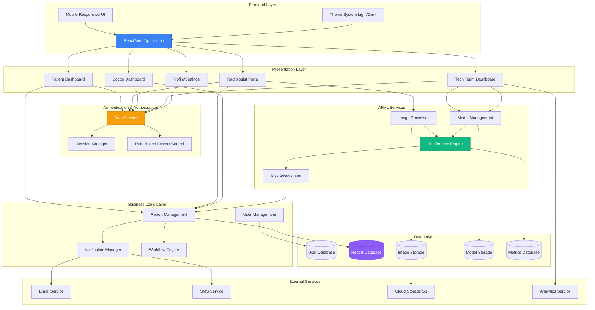
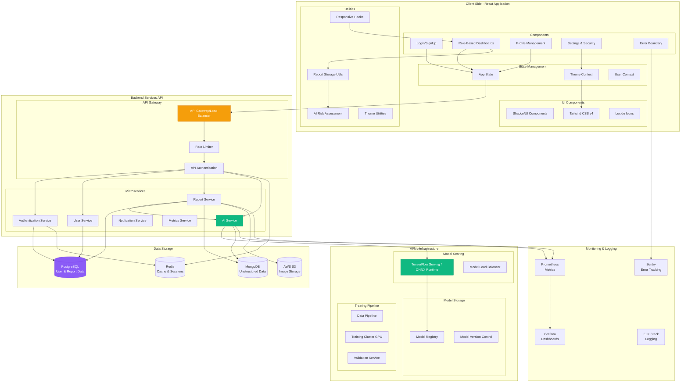
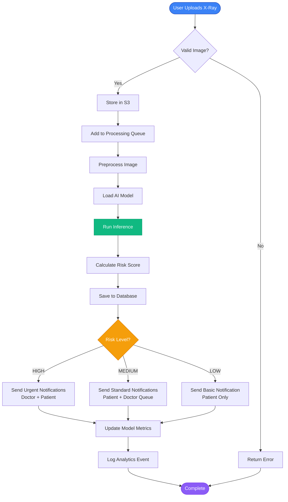
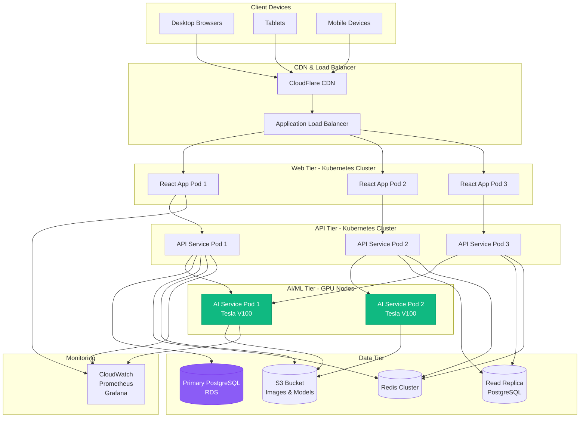

# Overall System Architecture

This document provides comprehensive architecture diagrams for the Medical Portal System.

## 1. High-Level System Architecture

## 2. Detailed Component Architecture

## 3. AI Model Architecture

```mermaid
graph LR
    subgraph "Input Layer"
        Input[X-Ray Image<br/>512x512x1]
    end
    
    subgraph "Preprocessing"
        Resize[Resize & Normalize]
        Augment[Augmentation<br/>rotation, flip, zoom]
        Denoise[Denoising Filter]
    end
    
    subgraph "Feature Extraction - CNN"
        Conv1[Conv2D 32 filters<br/>3x3, ReLU]
        Pool1[MaxPooling 2x2]
        Conv2[Conv2D 64 filters<br/>3x3, ReLU]
        Pool2[MaxPooling 2x2]
        Conv3[Conv2D 128 filters<br/>3x3, ReLU]
        Pool3[MaxPooling 2x2]
        Conv4[Conv2D 256 filters<br/>3x3, ReLU]
        Pool4[MaxPooling 2x2]
    end
    
    subgraph "Classification Head"
        Flatten[Flatten Layer]
        Dense1[Dense 512<br/>ReLU + Dropout 0.5]
        Dense2[Dense 256<br/>ReLU + Dropout 0.3]
        Output[Dense 3<br/>Softmax<br/>Low/Medium/High]
    end
    
    subgraph "Post-Processing"
        Threshold[Threshold Application]
        Confidence[Confidence Calculation]
        Explanation[Generate Explanation]
    end
    
    Input --> Resize
    Resize --> Augment
    Augment --> Denoise
    Denoise --> Conv1
    
    Conv1 --> Pool1
    Pool1 --> Conv2
    Conv2 --> Pool2
    Pool2 --> Conv3
    Conv3 --> Pool3
    Pool3 --> Conv4
    Conv4 --> Pool4
    
    Pool4 --> Flatten
    Flatten --> Dense1
    Dense1 --> Dense2
    Dense2 --> Output
    
    Output --> Threshold
    Threshold --> Confidence
    Confidence --> Explanation
    
    style Input fill:#3b82f6,stroke:#1e40af,color:#fff
    style Conv1 fill:#10b981,stroke:#059669,color:#fff
    style Conv2 fill:#10b981,stroke:#059669,color:#fff
    style Conv3 fill:#10b981,stroke:#059669,color:#fff
    style Conv4 fill:#10b981,stroke:#059669,color:#fff
    style Output fill:#f59e0b,stroke:#d97706,color:#fff
```

## 4. Data Flow Architecture

## 5. Deployment Architecture

## 6. Security Architecture

```mermaid
graph TB
    subgraph "External"
        User[Users]
        Attacker[Potential Threats]
    end
    
    subgraph "Security Perimeter"
        WAF[Web Application Firewall]
        DDoS[DDoS Protection]
        SSL[SSL/TLS Encryption]
    end
    
    subgraph "Authentication Layer"
        OAuth[OAuth 2.0]
        JWT[JWT Tokens]
        MFA[Multi-Factor Auth]
        SessionMgmt[Session Management]
    end
    
    subgraph "Authorization Layer"
        RBAC2[Role-Based Access Control]
        PermCheck[Permission Checker]
        AuditLog[Audit Logging]
    end
    
    subgraph "Application Security"
        InputVal[Input Validation]
        XSSProt[XSS Protection]
        CSRFProt[CSRF Protection]
        SQLInject[SQL Injection Prevention]
    end
    
    subgraph "Data Security"
        Encryption[Data Encryption at Rest]
        Anonymize[Data Anonymization]
        Backup[Encrypted Backups]
        KeyMgmt[Key Management Service]
    end
    
    subgraph "Network Security"
        VPC[Virtual Private Cloud]
        PrivateSubnet[Private Subnets]
        SecurityGroups[Security Groups]
        NetworkACL[Network ACLs]
    end
    
    User --> WAF
    Attacker --> WAF
    WAF --> DDoS
    DDoS --> SSL
    
    SSL --> OAuth
    OAuth --> JWT
    JWT --> MFA
    MFA --> SessionMgmt
    
    SessionMgmt --> RBAC2
    RBAC2 --> PermCheck
    PermCheck --> AuditLog
    
    AuditLog --> InputVal
    InputVal --> XSSProt
    XSSProt --> CSRFProt
    CSRFProt --> SQLInject
    
    SQLInject --> Encryption
    Encryption --> Anonymize
    Anonymize --> Backup
    Backup --> KeyMgmt
    
    KeyMgmt --> VPC
    VPC --> PrivateSubnet
    PrivateSubnet --> SecurityGroups
    SecurityGroups --> NetworkACL
    
    style WAF fill:#f59e0b,stroke:#d97706,color:#fff
    style Encryption fill:#8b5cf6,stroke:#7c3aed,color:#fff
    style RBAC2 fill:#3b82f6,stroke:#1e40af,color:#fff
```

## Key Architectural Principles

### 1. **Scalability**
- Horizontal scaling through Kubernetes pods
- Load balancing across multiple instances
- Caching layer with Redis for performance
- CDN for static asset delivery

### 2. **Reliability**
- Database replication for high availability
- Auto-scaling based on load
- Health checks and automatic recovery
- Data backup and disaster recovery

### 3. **Security**
- Multi-layer security (WAF, SSL, Auth, RBAC)
- Data encryption at rest and in transit
- Regular security audits
- HIPAA compliance ready

### 4. **Performance**
- GPU acceleration for AI inference
- Caching strategies
- Optimized database queries
- Lazy loading and code splitting

### 5. **Maintainability**
- Microservices architecture
- Clear separation of concerns
- Comprehensive monitoring and logging
- CI/CD pipeline for deployments

## Technology Stack

### Frontend
- React 18+ with TypeScript
- Tailwind CSS v4
- Shadcn/UI components
- Lucide Icons
- Motion/React for animations

### Backend
- Node.js / Python FastAPI
- PostgreSQL (relational data)
- MongoDB (unstructured data)
- Redis (caching & sessions)
- AWS S3 (file storage)

### AI/ML
- TensorFlow / PyTorch
- ONNX Runtime for inference
- OpenCV for image processing
- NumPy / Pandas for data processing

### Infrastructure
- Kubernetes for orchestration
- Docker for containerization
- AWS / GCP / Azure for cloud
- Terraform for IaC
- GitHub Actions for CI/CD

### Monitoring
- Prometheus for metrics
- Grafana for dashboards
- ELK Stack for logging
- Sentry for error tracking