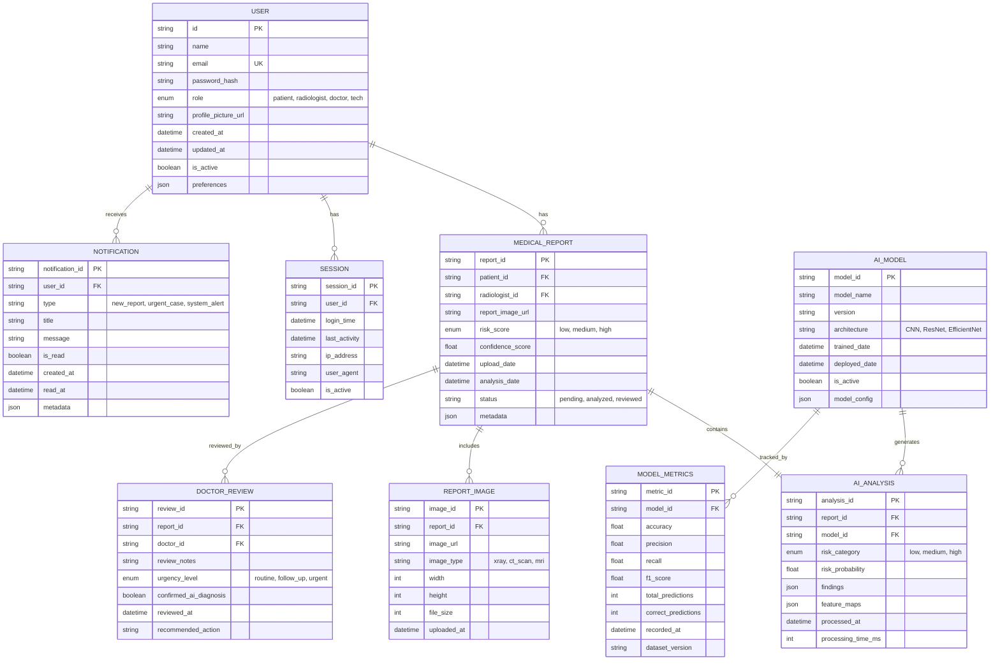

# Entity-Relationship Diagram

This ER diagram represents the database schema for the Medical Portal System.



## Entity Descriptions

### USER
- **Primary Key**: `id`
- **Purpose**: Stores all system users (patients, radiologists, doctors, tech team)
- **Relationships**: 
  - Has many medical reports (for patients)
  - Has many sessions
  - Receives many notifications

### MEDICAL_REPORT
- **Primary Key**: `report_id`
- **Purpose**: Central entity for X-ray reports and AI analysis results
- **Relationships**:
  - Belongs to one patient (user)
  - Uploaded by one radiologist (user)
  - Contains one AI analysis
  - May have multiple report images
  - Can be reviewed by multiple doctors

### AI_ANALYSIS
- **Primary Key**: `analysis_id`
- **Purpose**: Stores AI model predictions and risk assessments
- **Relationships**:
  - Belongs to one medical report
  - Generated by one AI model
  - Contains JSON findings with detailed analysis

### AI_MODEL
- **Primary Key**: `model_id`
- **Purpose**: Tracks different AI model versions and configurations
- **Relationships**:
  - Generates many AI analyses
  - Has many model metrics for performance tracking

### MODEL_METRICS
- **Primary Key**: `metric_id`
- **Purpose**: Tracks AI model performance over time
- **Relationships**:
  - Belongs to one AI model
  - Recorded at regular intervals for monitoring

### DOCTOR_REVIEW
- **Primary Key**: `review_id`
- **Purpose**: Stores doctor's clinical review of AI-analyzed reports
- **Relationships**:
  - Belongs to one medical report
  - Created by one doctor (user)

### NOTIFICATION
- **Primary Key**: `notification_id`
- **Purpose**: Manages system notifications for users
- **Relationships**:
  - Belongs to one user
  - Types: new reports, urgent cases, system alerts

### SESSION
- **Primary Key**: `session_id`
- **Purpose**: Manages user authentication sessions
- **Relationships**:
  - Belongs to one user
  - Tracks login activity and security

## Key Indexes

```sql
-- Performance optimization indexes
CREATE INDEX idx_report_patient ON MEDICAL_REPORT(patient_id);
CREATE INDEX idx_report_status ON MEDICAL_REPORT(status);
CREATE INDEX idx_report_risk ON MEDICAL_REPORT(risk_score);
CREATE INDEX idx_report_date ON MEDICAL_REPORT(upload_date DESC);
CREATE INDEX idx_analysis_model ON AI_ANALYSIS(model_id);
CREATE INDEX idx_notification_user ON NOTIFICATION(user_id, is_read);
CREATE INDEX idx_session_active ON SESSION(user_id, is_active);
```

## Data Constraints

- **Email**: Must be unique across all users
- **Risk Scores**: Enum values must be one of: 'low', 'medium', 'high'
- **User Roles**: Enum values must be one of: 'patient', 'radiologist', 'doctor', 'tech'
- **Confidence Score**: Float between 0.0 and 1.0
- **Risk Probability**: Float between 0.0 and 1.0
- **Cascade Delete**: Deleting a user archives their reports (soft delete)
- **Cascade Delete**: Deleting a report removes associated analyses and images