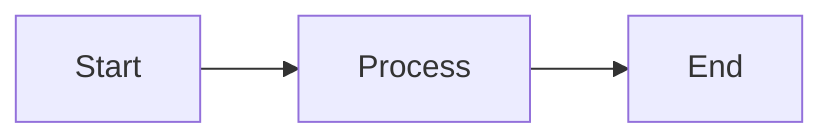

# How to View Mermaid Diagrams

All technical diagrams in this documentation are created using Mermaid syntax, which can be rendered in multiple ways.

## 📊 Viewing Options

### Option 1: GitHub (Recommended - Easiest)

GitHub natively supports Mermaid diagrams in Markdown files.

**Steps**:
1. Push your code to a GitHub repository
2. Navigate to the `/docs` folder
3. Click on any `.md` file (e.g., `ER-Diagram.md`)
4. GitHub will automatically render the Mermaid diagrams

**Pros**:
- ✅ No installation required
- ✅ Automatic rendering
- ✅ Easy to share links
- ✅ Mobile-friendly

---

### Option 2: VS Code Extension

Use the Mermaid Preview extension in Visual Studio Code.

**Steps**:
1. Install VS Code extension: **Markdown Preview Mermaid Support**
   - Extension ID: `bierner.markdown-mermaid`
2. Open any `.md` file in `/docs`
3. Press `Ctrl+Shift+V` (Windows/Linux) or `Cmd+Shift+V` (Mac)
4. View the rendered diagrams in the preview pane

**Pros**:
- ✅ Offline viewing
- ✅ Side-by-side editing and preview
- ✅ Fast rendering
- ✅ Good for development

---

### Option 3: Mermaid Live Editor

Use the official Mermaid online editor.

**Steps**:
1. Go to: https://mermaid.live
2. Copy the Mermaid code from any diagram (between the ` ```mermaid ` tags)
3. Paste into the editor
4. View, edit, and export the diagram

**Pros**:
- ✅ No installation required
- ✅ Export to PNG/SVG
- ✅ Share via URL
- ✅ Real-time editing

**Example**:
```
1. Open ER-Diagram.md
2. Copy everything between ```mermaid and ```
3. Paste into https://mermaid.live
4. View the rendered ER diagram
```

---

### Option 4: Notion, Obsidian, or Other Markdown Editors

Many modern Markdown editors support Mermaid diagrams natively.

**Supported Editors**:
- **Notion**: Paste as code block with language set to "mermaid"
- **Obsidian**: Install Mermaid plugin
- **Typora**: Native Mermaid support
- **GitBook**: Native support
- **Confluence**: Mermaid plugin available

---

### Option 5: Browser Extension

Install a browser extension to render Mermaid in local HTML files.

**Chrome/Edge**:
- Extension: **Markdown Viewer**
- Allows viewing `.md` files with Mermaid rendering

**Firefox**:
- Extension: **Markdown Viewer Webext**
- Similar functionality

---

### Option 6: Export to Images

Convert Mermaid diagrams to static images (PNG/SVG).

**Using Mermaid CLI**:
```bash
# Install Mermaid CLI
npm install -g @mermaid-js/mermaid-cli

# Convert diagram to PNG
mmdc -i docs/ER-Diagram.md -o docs/images/er-diagram.png

# Convert to SVG
mmdc -i docs/ER-Diagram.md -o docs/images/er-diagram.svg
```

**Using Mermaid Live Editor**:
1. Go to https://mermaid.live
2. Paste your diagram code
3. Click "Actions" → "Export PNG" or "Export SVG"
4. Save the image

---

## 📋 Diagram Files Overview

Here's what each diagram file contains:

### 1. **ER-Diagram.md**
**Content**:
- Database entity-relationship diagram
- Table structures
- Relationships and foreign keys
- Indexes and constraints

**Best Viewed In**: GitHub, Mermaid Live Editor  
**Diagram Type**: ER Diagram  
**Complexity**: Medium

---

### 2. **UML-Diagram.md**
**Content**:
- Class structure and hierarchy
- Object-oriented design
- Inheritance relationships
- Design patterns

**Best Viewed In**: Mermaid Live Editor (for export)  
**Diagram Type**: UML Class Diagram  
**Complexity**: High (many classes)

---

### 3. **Sequence-Diagram.md**
**Content**:
- 6 detailed sequence diagrams
- User interaction flows
- System component communication
- API call sequences

**Best Viewed In**: GitHub, VS Code  
**Diagram Type**: Sequence Diagrams  
**Complexity**: Medium-High

**Diagrams Included**:
1. Patient Login and View Reports
2. Radiologist Upload X-Ray (AI-Powered)
3. Doctor Review AI-Generated Report
4. Tech Team Monitor AI Model
5. Complete User Journey
6. AI Model Prediction Pipeline

---

### 4. **Architecture-Diagram.md**
**Content**:
- 6 comprehensive architecture diagrams
- System components and layers
- Deployment architecture
- Security architecture

**Best Viewed In**: Mermaid Live Editor, GitHub  
**Diagram Type**: Architecture Diagrams (Flowcharts, Graphs)  
**Complexity**: High

**Diagrams Included**:
1. High-Level System Architecture
2. Detailed Component Architecture
3. AI Model Architecture
4. Data Flow Architecture
5. Deployment Architecture
6. Security Architecture

---

### 5. **AI-Model-Image-Processing.md**
**Content**:
- Detailed AI pipeline flowchart
- Image processing steps
- Code examples with Python/TypeScript
- Performance metrics

**Best Viewed In**: GitHub (combines diagrams + code)  
**Diagram Type**: Flowchart  
**Complexity**: High (detailed pipeline)

---

## 🎨 Diagram Rendering Tips

### For Best Quality

1. **Desktop Viewing**: Use GitHub or Mermaid Live Editor
2. **Print/Documentation**: Export to SVG (vector graphics)
3. **Presentations**: Export to PNG at high DPI
4. **Editing**: Use Mermaid Live Editor with real-time preview

### For Collaboration

1. **Share Links**: Push to GitHub and share repository URL
2. **Export PDFs**: Use browser print to PDF from GitHub
3. **Embed in Docs**: Copy Mermaid code into your documentation
4. **Screenshots**: Take screenshots from Mermaid Live Editor

### For Development

1. **VS Code**: Use Markdown Preview Mermaid Support extension
2. **Live Reload**: Edit in VS Code with live preview
3. **Version Control**: Keep diagrams as code in Git
4. **Documentation Site**: Use GitBook, Docusaurus, or VuePress

---

## 🔧 Troubleshooting

### Diagram Not Rendering

**Problem**: Mermaid code shows as plain text

**Solutions**:
1. Ensure you're using a Mermaid-compatible viewer
2. Check that code is wrapped in ` ```mermaid ` fence
3. Verify no syntax errors in Mermaid code
4. Try a different viewer (GitHub, Mermaid Live)

### Diagram Too Large

**Problem**: Diagram is cut off or too small

**Solutions**:
1. Use Mermaid Live Editor and zoom
2. Export to SVG for infinite scaling
3. Adjust your browser zoom level
4. Use GitHub's full-width view

### Syntax Errors

**Problem**: Diagram shows error message

**Solutions**:
1. Copy code to Mermaid Live Editor for validation
2. Check for missing quotes, brackets, or semicolons
3. Verify entity names don't have spaces
4. Ensure proper indentation

---

## 📱 Mobile Viewing

### GitHub Mobile App
- ✅ Supports Mermaid rendering
- ✅ Tap diagrams to zoom
- ✅ Pinch to zoom
- ✅ Landscape mode for wider diagrams

### Mobile Browser
- ✅ Use GitHub in mobile browser
- ✅ Request desktop site for better rendering
- ✅ Use Mermaid Live Editor for editing

---

## 🎓 Learning Mermaid

Want to create or modify diagrams?

**Official Resources**:
- **Documentation**: https://mermaid.js.org
- **Tutorial**: https://mermaid.js.org/intro/
- **Examples**: https://github.com/mermaid-js/mermaid/tree/develop/demos

**Quick Start**:


**Diagram Types Supported**:
- Flowchart
- Sequence Diagram
- Class Diagram (UML)
- State Diagram
- ER Diagram
- User Journey
- Gantt Chart
- Pie Chart
- Git Graph
- And more...

---

## 📦 Recommended Setup

For the best documentation experience:

### For Developers
1. **IDE**: VS Code with Markdown Mermaid extension
2. **Preview**: Side-by-side Markdown preview
3. **Version Control**: GitHub for sharing
4. **Export**: Mermaid CLI for automation

### For Product Managers
1. **Viewing**: GitHub web interface
2. **Sharing**: GitHub repository links
3. **Export**: Mermaid Live Editor to PNG/SVG
4. **Presentations**: Export images for slides

### For Stakeholders
1. **Viewing**: GitHub (no setup required)
2. **Offline**: PDF exports from GitHub
3. **Printing**: Browser print to PDF
4. **Mobile**: GitHub mobile app

---

## 🎯 Quick Reference

| Diagram | File | Best Tool | Complexity |
|---------|------|-----------|------------|
| ER Diagram | ER-Diagram.md | GitHub / Mermaid Live | Medium |
| UML Classes | UML-Diagram.md | Mermaid Live | High |
| Sequences | Sequence-Diagram.md | GitHub / VS Code | Medium |
| Architecture | Architecture-Diagram.md | Mermaid Live | High |
| AI Pipeline | AI-Model-Image-Processing.md | GitHub | High |

---

## 💡 Pro Tips

1. **Syntax Highlighting**: Use Mermaid Live Editor to catch errors
2. **Version Control**: Keep diagrams as code for easy updates
3. **Export Once**: Create high-quality SVGs for reuse
4. **Browser Zoom**: Use Ctrl/Cmd + Plus to zoom diagrams
5. **Full Screen**: Press F11 in browser for distraction-free viewing
6. **Dark Mode**: Mermaid Live Editor supports dark theme
7. **Share Links**: Use GitHub permalink for stable links
8. **Print Settings**: Use landscape orientation for wide diagrams

---

## 📞 Need Help?

If you're having trouble viewing the diagrams:

1. **Check GitHub**: Most reliable for viewing
2. **Try Mermaid Live**: https://mermaid.live
3. **Contact Team**: tech-support@medicalportal.com
4. **Request Export**: Ask for PNG/SVG versions

---

**Happy Diagram Viewing! 📊✨**

The diagrams are designed to provide comprehensive visual documentation of the Medical Portal System. Choose the viewing method that works best for your workflow!