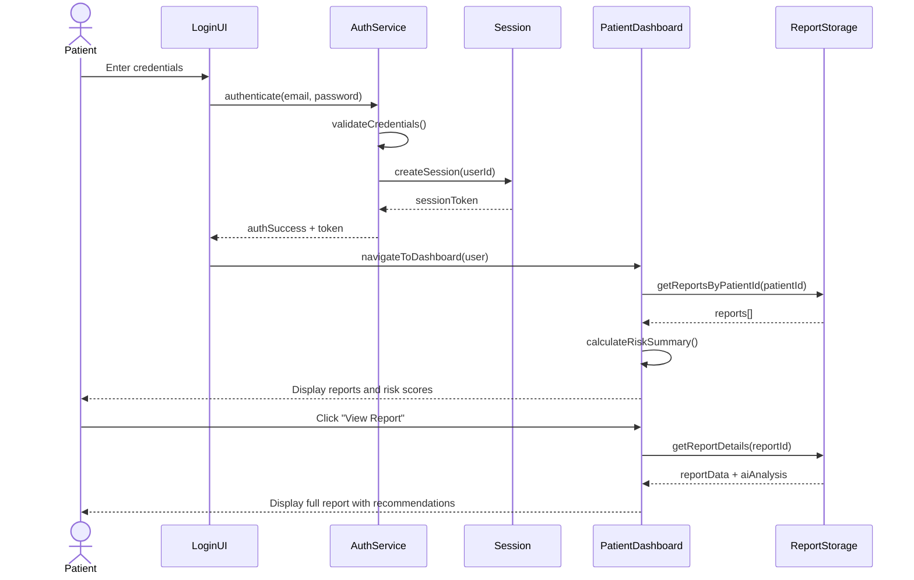
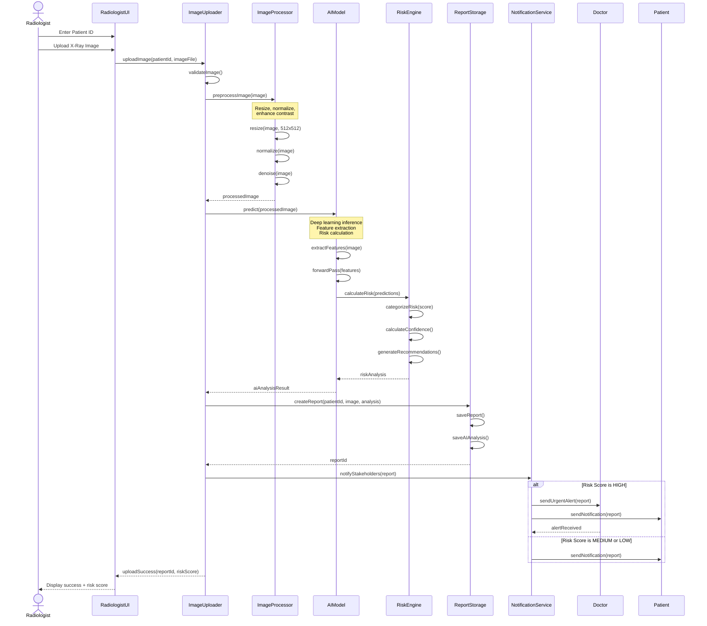
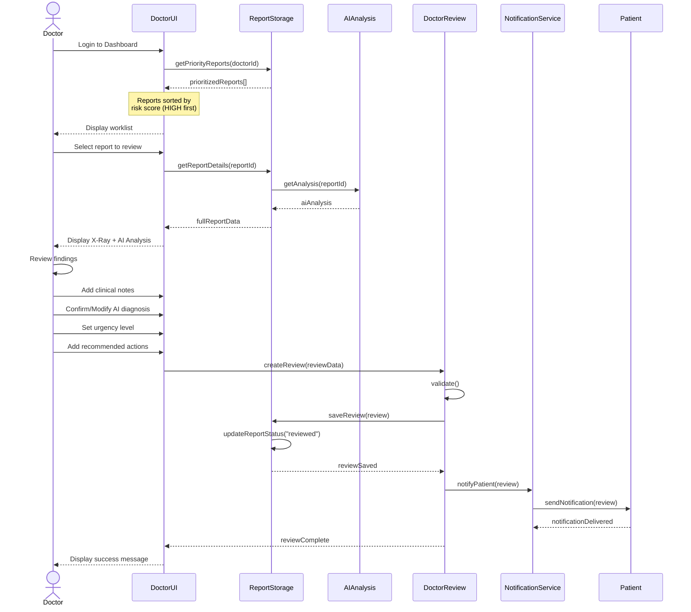
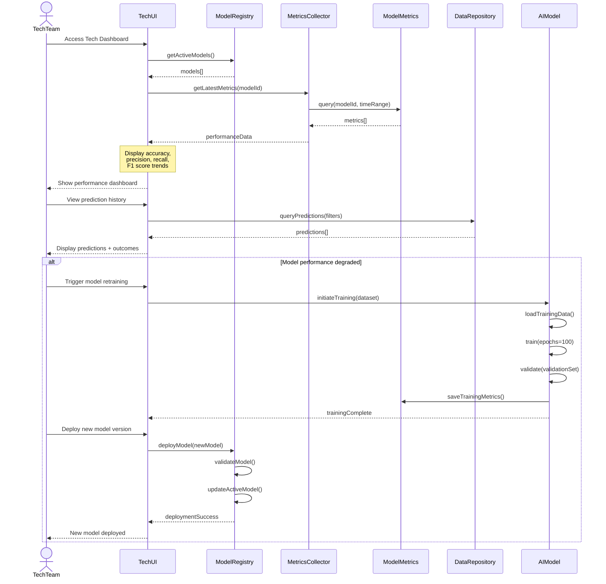
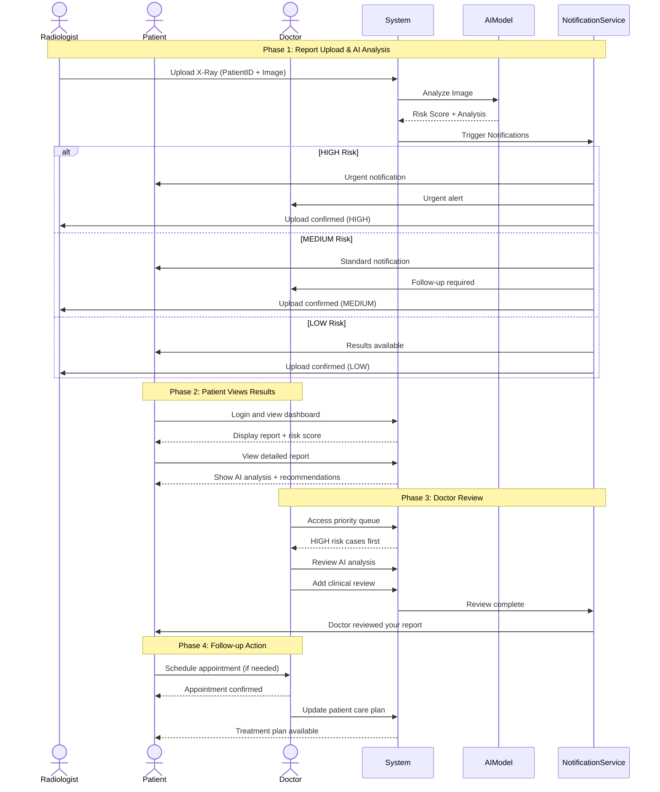
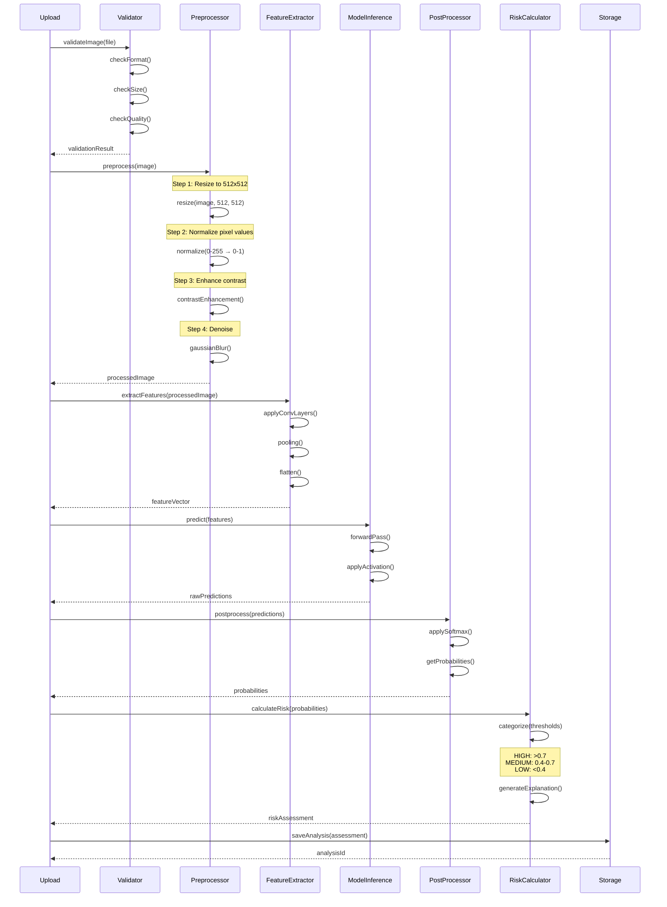

# Sequence Diagrams

This document contains sequence diagrams for key workflows in the Medical Portal System.

## 1. Patient Login and View Reports

## 2. Radiologist Upload X-Ray Report (AI-Powered)

## 3. Doctor Review AI-Generated Report

## 4. Tech Team Monitor AI Model Performance

## 5. Complete User Journey: From Upload to Treatment

## 6. AI Model Prediction Pipeline (Detailed)

## Key Workflows Summary

1. **Patient Flow**: Login → View Dashboard → Check Reports → Read AI Analysis → Contact Doctor
2. **Radiologist Flow**: Login → Enter Patient ID → Upload X-Ray → AI Auto-Analysis → Confirmation
3. **Doctor Flow**: Login → Priority Queue → Review AI Analysis → Add Clinical Notes → Approve/Modify
4. **Tech Team Flow**: Login → Monitor Metrics → Analyze Performance → Retrain/Deploy Models
5. **AI Pipeline**: Upload → Validate → Preprocess → Extract Features → Predict → Calculate Risk → Store

## Timing Considerations

- **Image Upload**: ~2-5 seconds
- **AI Analysis**: ~5-10 seconds
- **Risk Calculation**: ~1-2 seconds
- **Notification Delivery**: ~1-3 seconds
- **Total Time (Upload to Notification)**: ~10-20 seconds

## Error Handling

Each workflow includes error handling for:
- Authentication failures
- Invalid image formats
- AI model errors
- Database connection issues
- Network timeouts
- Insufficient permissions