# UML Class Diagram

This UML diagram shows the class structure and relationships in the Medical Portal System.

```mermaid
classDiagram
    class User {
        -string id
        -string name
        -string email
        -string passwordHash
        -UserRole role
        -string profilePictureUrl
        -Date createdAt
        -Date updatedAt
        -boolean isActive
        -UserPreferences preferences
        +login(email, password) Session
        +logout() void
        +updateProfile(data) User
        +changePassword(oldPass, newPass) boolean
        +getNotifications() Notification[]
        +hasPermission(action) boolean
    }
    
    class Patient {
        -string patientId
        -MedicalHistory medicalHistory
        -string emergencyContact
        +viewReports() MedicalReport[]
        +getLatestReport() MedicalReport
        +getRiskSummary() RiskSummary
        +downloadReport(reportId) File
        +requestAppointment() Appointment
    }
    
    class Radiologist {
        -string radiologistId
        -string licenseNumber
        -string specialization
        -int workloadCount
        +uploadReport(patientId, image) MedicalReport
        +viewWorklist() MedicalReport[]
        +updateReportStatus(reportId, status) void
        +getPerformanceMetrics() Metrics
    }
    
    class Doctor {
        -string doctorId
        -string licenseNumber
        -string specialty
        -string[] certifications
        +reviewReport(reportId) DoctorReview
        +getPriorityQueue() MedicalReport[]
        +addClinicalNotes(reportId, notes) void
        +requestFollowUp(patientId) Appointment
        +approveAIAnalysis(analysisId) boolean
    }
    
    class TechTeam {
        -string techId
        -string role
        -string[] permissions
        +viewSystemMetrics() SystemMetrics
        +manageAIModel(modelId) void
        +monitorPerformance() ModelMetrics[]
        +accessDataRepository() Dataset[]
        +deployModel(model) boolean
        +generateAnalytics() Report
    }
    
    class MedicalReport {
        -string reportId
        -string patientId
        -string radiologistId
        -string imageUrl
        -RiskScore riskScore
        -float confidenceScore
        -Date uploadDate
        -Date analysisDate
        -ReportStatus status
        -ReportMetadata metadata
        +analyze() AIAnalysis
        +getPatient() Patient
        +getRadiologist() Radiologist
        +getDoctorReviews() DoctorReview[]
        +updateStatus(status) void
        +generatePDF() File
    }
    
    class AIAnalysis {
        -string analysisId
        -string reportId
        -string modelId
        -RiskCategory riskCategory
        -float riskProbability
        -Finding[] findings
        -FeatureMap[] featureMaps
        -Date processedAt
        -int processingTimeMs
        +calculateRisk() RiskScore
        +extractFeatures() FeatureMap[]
        +generateExplanation() string
        +getConfidenceMetrics() ConfidenceMetrics
    }
    
    class AIModel {
        -string modelId
        -string modelName
        -string version
        -ModelArchitecture architecture
        -Date trainedDate
        -Date deployedDate
        -boolean isActive
        -ModelConfig config
        +predict(image) Prediction
        +train(dataset) TrainingResult
        +evaluate(testData) Metrics
        +loadWeights(path) void
        +saveCheckpoint() void
        +getArchitecture() ModelStructure
    }
    
    class ImageProcessor {
        -string processorId
        -ProcessorConfig config
        +preprocess(image) ProcessedImage
        +resize(image, dimensions) Image
        +normalize(image) Image
        +augment(image, params) Image[]
        +extractROI(image) Region[]
        +denoise(image) Image
    }
    
    class RiskAssessmentEngine {
        -string engineId
        -AIModel model
        -ThresholdConfig thresholds
        +assessRisk(image) RiskScore
        +calculateProbability(features) float
        +categorizeRisk(score) RiskCategory
        +generateRecommendations(risk) string[]
        +explainDecision(analysis) Explanation
    }
    
    class NotificationService {
        -string serviceId
        -NotificationConfig config
        +sendNotification(user, message) boolean
        +sendUrgentAlert(users[], report) void
        +sendEmail(email, subject, body) boolean
        +sendSMS(phone, message) boolean
        +scheduleReminder(user, datetime) void
    }
    
    class AuthenticationService {
        -string serviceId
        -SecurityConfig config
        +authenticate(email, password) Session
        +verifyToken(token) User
        +generateToken(user) string
        +refreshToken(token) string
        +revokeSession(sessionId) void
        +enableTwoFactor(userId) string
        +verifyTwoFactor(userId, code) boolean
    }
    
    class DataRepository {
        -string repoId
        -StorageConfig config
        +store(data) string
        +retrieve(id) Data
        +update(id, data) boolean
        +delete(id) boolean
        +query(filters) Data[]
        +backup() boolean
        +anonymize(data) Data
    }
    
    class ModelMetrics {
        -string metricId
        -string modelId
        -float accuracy
        -float precision
        -float recall
        -float f1Score
        -int totalPredictions
        -int correctPredictions
        -Date recordedAt
        +calculateMetrics(predictions) Metrics
        +compareModels(model1, model2) Comparison
        +trackPerformance() void
        +generateReport() Report
    }
    
    class Session {
        -string sessionId
        -string userId
        -Date loginTime
        -Date lastActivity
        -string ipAddress
        -string userAgent
        -boolean isActive
        +isValid() boolean
        +refresh() void
        +terminate() void
        +updateActivity() void
    }
    
    class Notification {
        -string notificationId
        -string userId
        -NotificationType type
        -string title
        -string message
        -boolean isRead
        -Date createdAt
        -Date readAt
        +markAsRead() void
        +delete() void
        +resend() boolean
    }
    
    class DoctorReview {
        -string reviewId
        -string reportId
        -string doctorId
        -string reviewNotes
        -UrgencyLevel urgencyLevel
        -boolean confirmedAIDiagnosis
        -Date reviewedAt
        -string recommendedAction
        +save() boolean
        +update(data) void
        +generateSummary() string
    }
    
    %% Inheritance Relationships
    User <|-- Patient
    User <|-- Radiologist
    User <|-- Doctor
    User <|-- TechTeam
    
    %% Composition Relationships
    User *-- Session : has
    User *-- Notification : receives
    MedicalReport *-- AIAnalysis : contains
    AIModel *-- ModelMetrics : tracks
    MedicalReport *-- DoctorReview : reviewed by
    
    %% Association Relationships
    Patient --> MedicalReport : owns
    Radiologist --> MedicalReport : uploads
    Doctor --> DoctorReview : creates
    AIModel --> AIAnalysis : generates
    TechTeam --> AIModel : manages
    
    %% Dependency Relationships
    AIAnalysis ..> ImageProcessor : uses
    AIAnalysis ..> RiskAssessmentEngine : uses
    RiskAssessmentEngine ..> AIModel : uses
    NotificationService ..> User : notifies
    AuthenticationService ..> User : authenticates
    AuthenticationService ..> Session : creates
    DataRepository ..> MedicalReport : stores
    
    %% Aggregation Relationships
    User o-- Notification : contains
    MedicalReport o-- DoctorReview : has
```

## Class Details

### Core User Classes

#### User (Abstract)
Base class for all user types with common authentication and profile management functionality.

#### Patient
Extends User. Can view their own reports, risk scores, and educational content.

#### Radiologist
Extends User. Uploads X-ray reports and patient information. The AI automatically processes uploads.

#### Doctor
Extends User. Reviews AI-analyzed reports, adds clinical notes, and manages patient follow-ups.

#### TechTeam
Extends User. Manages AI models, monitors system performance, and accesses data repositories.

### Core Medical Classes

#### MedicalReport
Central entity representing an X-ray report with associated patient data, AI analysis, and status.

#### AIAnalysis
Contains the AI model's predictions, risk scores, confidence metrics, and detailed findings.

#### DoctorReview
Stores a doctor's clinical review and validation of AI-generated analysis.

### AI/ML Classes

#### AIModel
Represents a trained machine learning model for X-ray analysis with versioning and configuration.

#### ImageProcessor
Handles image preprocessing, normalization, and augmentation for AI analysis.

#### RiskAssessmentEngine
Core logic for calculating risk scores and generating clinical recommendations.

#### ModelMetrics
Tracks AI model performance metrics over time for quality assurance.

### Service Classes

#### AuthenticationService
Handles user authentication, session management, and security.

#### NotificationService
Manages notifications, alerts, and communication to users.

#### DataRepository
Handles data storage, retrieval, and anonymization for research purposes.

## Design Patterns Used

1. **Inheritance**: User hierarchy (Patient, Radiologist, Doctor, TechTeam)
2. **Composition**: User has Session, MedicalReport contains AIAnalysis
3. **Dependency Injection**: Services depend on interfaces, not concrete classes
4. **Strategy Pattern**: Different risk assessment strategies for different model types
5. **Observer Pattern**: Notification system observes report status changes
6. **Factory Pattern**: Creating different types of notifications and reports
7. **Singleton Pattern**: AuthenticationService, DataRepository (single instances)
8. **Repository Pattern**: DataRepository abstracts data access layer

## Key Principles

- **Single Responsibility**: Each class has one clear purpose
- **Open/Closed**: Classes open for extension, closed for modification
- **Liskov Substitution**: Derived user classes can substitute base User class
- **Interface Segregation**: Small, focused interfaces for services
- **Dependency Inversion**: High-level modules depend on abstractions